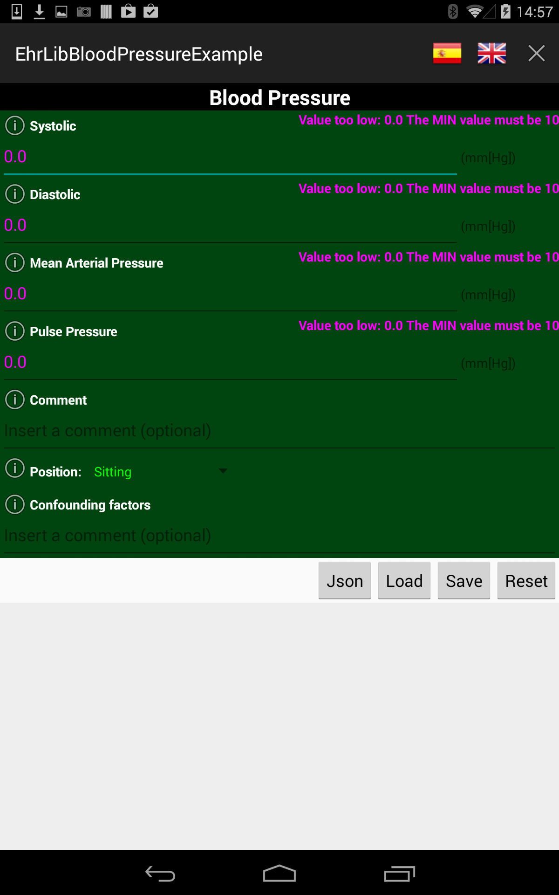
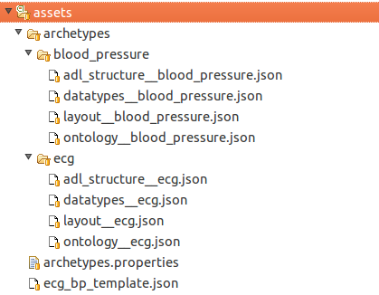
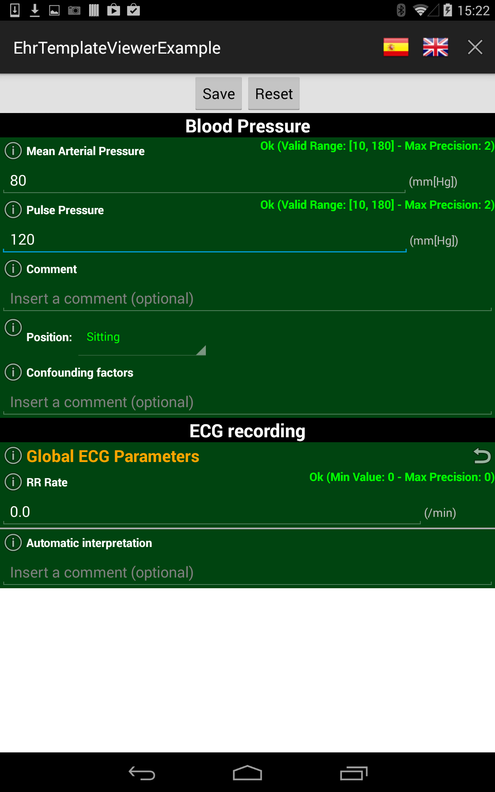

Basic Concepts
==============

The Most EhrLib allow you to build, render and edit Open EHR based archetypes (http://www.openehr.org/) into your android applications.
The lib uses specific json schemas for describing the structure, the ontology and the content of each archetype.

For example, assuming you want to build the well known Blood Pressure archetype, at least the following json schemas must be provided:

  - *adl_structure__blood_pressure.json*: it contains the structure of the archetype, corresponding to the ADL structure defined by the Open EHR standard
  - *datatypes__blood_pressure.json*: it contains the description of all datatypes used by this archetype (e.g: DV_QUANTITY, DV_CLUSTER and so on)
  - *ontology__blood_pressure.json*: it contains the ontology  of this archetype (i.e a textual title and description of each item of the archetype)
  
Note that for representing *any* archetype,  the previous json schemas are mandatory. Optionally, if you need to customize the visual layout of the archetype,
you can also specify a layout json schema, *layout__blood_pressure.json*,  as explained in the next section.

Basic Example: how to build a single archetype: Blood Pressure
--------------------------------------------------------------

This section explains how to build, step by step, a Blood Pressure archetype and how to include it in an Android Application

First of all you need to build the json schemas. Let start with the *adl_structure__blood_pressure.json*:

.. code-block:: json

   {
    "archetype_class": "openEHR-EHR-OBSERVATION.blood_pressure.v1",
    "archetype_details": {
        "data": {
            "at0001": [
                {
                    "events": [
                        {
                            "at0006": {
                                "data": {
                                    "at0003": [
                                        {
                                            "items": {
                                                "at0004": "DATA_NODE::DV_QUANTITY",
                                                "at0005": "DATA_NODE::DV_QUANTITY",
                                                "at1006": "DATA_NODE::DV_QUANTITY",
                                                "at1007": "DATA_NODE::DV_QUANTITY",
                                                "at0033": "DATA_NODE::DV_TEXT"
                                            }
                                        }
                                    ]
                                },
                                "state": {
                                    "at0007": [
                                        {
                                            "items": {
                                                "at0008": "DATA_NODE::DV_CODED_TEXT",
                                                "at1052": "DATA_NODE::DV_TEXT"
                                            },
                                            "at1030": "ARCHETYPE_NODE",
                                            "at1043": "DATA_NODE::DV_CODED_TEXT",
                                            "at1005": "DATA_NODE::DV_QUANTITY"
                                        }
                                    ]
                                }
                            },
                            "at1042": "DATA_NODE::MATH_FUNCTION"
                        }
                    ]
                }
              ]
          }
      }
  }
  
Note that the structure is very similar to the corresponing ADl structure defined by the Open EHR adl structure (you can find the adl structure of the Blood Pressure Archetype here: http://openehr.org/ckm/). 
Each item of the structure has a unique identifier (such as "at0004") that represents a specific item of the archetype. Each item is of a specific type (for example, the item at0004 is a DV_QUANTITY item).

The datatype description of each item is specified in the  *datatypes__blood_pressure.json* schema:

.. code-block:: json

   {
    "title": "at0000",
    "datatypes": {
        "data": {
            "at0004": {
                "path": "data[at0001]/events[at0006]/data[at0003]/items[at0004]",
                "type": "DV_QUANTITY",
                "attributes": {
                    "unit_of_measure": "mm[Hg]",
                    "precision": 2,
                    "range": {
                        "min": 10,
                        "max": 180
                    }
                }
            },
            "at0005": {
                "path": "data[at0001]/events[at0006]/data[at0003]/items[at0005]",
                "type": "DV_QUANTITY",
                "attributes": {
                    "unit_of_measure": "mm[Hg]",
                    "precision": 2,
                    "range": {
                        "min": 10,
                        "max": 180
                    }
                }
            },
            "at1006": {
                "path": "data[at0001]/events[at0006]/data[at0003]/items[at1006]",
                "type": "DV_QUANTITY",
                "attributes": {
                    "unit_of_measure": "mm[Hg]",
                    "precision": 2,
                    "range": {
                        "min": 10,
                        "max": 180
                    }
                }
            },
            "at1007": {
                "path": "data[at0001]/events[at0006]/data[at0003]/items[at1007]",
                "type": "DV_QUANTITY",
                "attributes": {
                    "unit_of_measure": "mm[Hg]",
                    "precision": 2,
                    "range": {
                        "min": 10,
                        "max": 180
                    }
                }
            },
            "at0033": {
                "path": "data[at0001]/events[at0006]/data[at0003]/items[at0033]",
                "type": "DV_TEXT",
                "attributes": {}
            }
        }
     }
  }

All datatypes are specified into the *datatypes* json dictionary. In the example above you defined the *data* section of the archetype, so that, you found the corresponding *data* json dictionary containing the descriptions of all items contained inside it.
For example, there is the *item0004* with the following informations:

.. code-block:: json

   {
    "at0004": {
                "path": "data[at0001]/events[at0006]/data[at0003]/items[at0004]",
                "type": "DV_QUANTITY",
                "attributes": {
                    "unit_of_measure": "mm[Hg]",
                    "precision": 2,
                    "range": {
                        "min": 10,
                        "max": 180
                    }
          }
       }
   }
 
 The item *at0004* is a *DV_QUANTITY* item, located inside the ADL structure of the archetype at the absolute path *data[at0001]/events[at0006]/data[at0003]/items[at0004]*.
 Note that each datatype has specific attributes that can be specified. In this example, the DV_QUANTITY item has its unit of measure, precision and a range of allowed numeric values. 
 Again, see the Open EHR reference for getting more informations about Open EHR data types.
 
 The description of each item is specified by the *ontology__blood_pressure.json* schema:
 
.. code-block:: json

   {
    "en":{
      "at0000":{
         "text":"Blood Pressure",
         "description":"The local measurement of arterial blood pressure which is a surrogate for arterial. pressure in the systemic circulation. Most commonly, use of the term 'blood pressure' refers to measurement of brachial artery pressure in the upper arm."
      },
      "at0001":{
         "text":"history",
         "description":"History Structural node."
      },
      "at0003":{
         "text":"blood pressure",
         "description":"internal"
      },
      "at0004":{
         "text":"Systolic",
         "description":"Peak systemic arterial blood pressure  - measured in systolic or contraction phase of the heart cycle."
      },
      "at0005":{
         "text":"Diastolic",
         "description":"Minimum systemic arterial blood pressure - measured in the diastolic or relaxation phase of the heart cycle."
      },
      "at0006":{
         "text":"any event",
         "description":"Default event."
      },
      "at0007":{
         "text":"state structure",
         "description":"internal"
      },
      "at0008":{
         "text":"Position",
         "description":"The position of the subject at the time of measurement."
      },
      "at0011":{
         "text":"Tree",
         "description":"List Structure"
      },
      "at0013":{
         "text":"Cuff Size",
         "description":"The size of the cuff used for blood pressure measurement."
      },
      "at0033":{
         "text":"Comment",
         "description":"Comment on blood pressure measurement."
      },
      "at1006":{
         "text":"Mean Arterial Pressure",
         "description":"The average arterial pressure that occurs over the entire course of the heart contraction and relaxation cycle."
      },
      "at1007":{
         "text":"Pulse Pressure",
         "description":"The difference between the systolic and diastolic pressure."
      },
      "at0033":{
         "text":"Comment",
         "description":"Comment on blood pressure measurement."
      },
      "at1000":{
         "text":"Standing",
         "description":"Standing at the time of blood pressure measurement."
      },
      "at1001":{
         "text":"Sitting",
         "description":"Sitting (for example on bed or chair) at the time of blood pressure measurement."
      },
      "at1002":{
         "text":"Reclining",
         "description":"Reclining at the time of blood pressure measurement."
      },
      "at1003":{
         "text":"Lying",
         "description":"Lying flat at the time of blood pressure measurement."
      },
      "at1014":{
         "text":"Lying with tilt to left",
         "description":"Lying flat with some lateral tilt, usually angled towards the left side.   Commonly required in the last trimester of pregnancy to relieve aortocaval compression."
      },
      "at1052":{
         "text":"Confounding factors",
         "description":"Comment on and record other incidental factors that may be contributing to the blood pressure measurement.  For example, level of anxiety or 'white coat syndrome'; pain or fever; changes in atmospheric pressure etc."
      },
      
      "at1025":{
         "text":"Blood Pressure",
         "description":"Included archetype, just for testing"
      }
      
   },
   
   "es-ar":{
      "at0000":{
         "text":"Presión Arterial",
         "description":"La medición local de la tensión arterial que deriva de la medida de la presión arterial en la circulación sistémica. Comúnmente el uso de 'presión arterial' se refiere a la medida de la presión de la arteria braquial por encima del pliegue del codo."
      },
      "at0001":{
         "text":"historia",
         "description":"historia Nodo estructural"
      },
      "at0003":{
         "text":"blood pressure",
         "description":"internal"
      },
      "at0004":{
         "text":"Sistólica",
         "description":"Presión arterial sistólica pico - medido en sístole o la fase de contracción del ciclo cardíaco."
      },
      "at0005":{
         "text":"Diástole",
         "description":"Presión arterial sistémica mínima - medido durante la diástole o fase de relajación del ciclo cardíaco."
      },
      "at0006":{
         "text":"cualquier evento",
         "description":"Evento por defecto."
      },
      "at0007":{
         "text":"state structure",
         "description":"internal"
      },
      "at0008":{
         "text":"Posición",
         "description":"La posición del individuo en el momento del registro."
      },
      "at0011":{
         "text":"estructura de lista",
         "description":"estructura tipo lista"
      },
      "at0013":{
         "text":"Tamaño del manguito",
         "description":"El tamaño del manguito usado para la toma de la presión arterial."
      },
      "at0033":{
         "text":"Comment",
         "description":"Comment on blood pressure measurement."
      },
      "at1006":{
         "text":"Presión Arterial Media",
         "description":"La presión arterial promedio que ocurre durante el ciclo entero de la contracción y relajación del corazon."
      },
      "at1007":{
         "text":"Presión de Pulso",
         "description":"La diferencia entre la presión sistólica y la presión diastólica."
      },
      "at0033":{
         "text":"Comentario",
         "description":"Comentario sobre la medición de la presión sanguínea"
      },
      "at1000":{
         "text":"De pie",
         "description":"De pie al momento de la medición de la tensión arterial."
      },
      "at1001":{
         "text":"Sentado",
         "description":"Sentado (en la cama o en una silla) durante el registro de la presión arterial."
      },
      "at1002":{
         "text":"Reclinado",
         "description":"Reclinado (semisentado) durante el registro de la presión arterial."
      },
      "at1003":{
         "text":"Acostado",
         "description":"Acostado horizontal durante la medición de la presión arterial"
      },
      "at1014":{
         "text":"Acostado e inclinado levemente sobre su costado izquierdo",
         "description":"Acostado horizontal e inclinado levemente sobre su costado izquierdo. Comúnmente se requiere durante el último trimestre del embarazo para aliviar la compresión aortocava."
      },
      "at1052":{
         "text":"Factores confluentes",
         "description":"Comentario y registro sobre otros factores que pueden incidir sobre la medición de la presión arterial. Por ejemplo: nivel de ansiedad o \"síndrome del guardapolvo blanco\"; dolor o fiebre; cambios en la presión atmosférica etc."
      },
      
      "at1025":{
         "text":"Presión Arterial",
         "description":"Included archetype, just for testing"
      }  
    }
   }
 
 In this example, you are handling the English and the Spanish language. For each item, a textual label and a short description is provided for both languages. 
 
 Finally, you can optionally provide a *layout__blood_pressure.json* schema (for example if you want to display the item of the systolic pressure before the item of the diastolic pressure)
 
.. code-block:: json

   {
   "sections":[
      "data"
   ],
   "items":{
      "data[at0001]/events[at0006]/data[at0003]/items[at0004]":{
         "priority":1
      },
      "data[at0001]/events[at0006]/data[at0003]/items[at0005]":{
         "priority":2
      },
      "data[at0001]/events[at0006]/data[at0003]/items[at1006]":{
         "priority":3
      },
      "data[at0001]/events[at0006]/data[at0003]/items[at1007]":{
         "priority":4
      },
      "data[at0001]/events[at0006]/data[at0003]/items[at0033]":{
         "priority":5
      },
      "data[at0001]/events[at0006]/state[at0007]/items[at0008]":{
         "priority":1,
         "widget":"it.crs4.ehrlib.widgets.DvCodedTextAsListWidget"
      },
      "data[at0001]/events[at0006]/state[at0007]/items[at1052]":{
         "priority":2
      }
   }
  }

In this example, you use the *priority* attribute for specifying the display order of each item (items with lower priority are displayed before). 
If you want, you can also render an item with a custom widget, by specifying the java class representing that datatype in the *widget* attribute.
Note that you don't have to specify all items of the datatype, because all items of the datatypes will be rendered anyway. The layout specifies only the displaying order, not a sub set of items to be displayed.
Note that you can render a sub set of an archetype item by providing a list of items to be excluded by using a TemplateProvider, as explained later in this guide.
Finally, if you prefer, you can use *aliases* for referring to each item in a more human-readable way, as follows:

.. code-block:: json

   {
   "sections":[
      "data"
   ],
   
   "aliases" :
     {
     "data[at0001]/events[at0006]/data[at0003]/items[at0004]": "Systolic",
     "data[at0001]/events[at0006]/data[at0003]/items[at0005]": "Diastolic",
     "data[at0001]/events[at0006]/data[at0003]/items[at1006]": "Arterial Pressure",
     "data[at0001]/events[at0006]/data[at0003]/items[at1007]": "Pulse Pressure"
     },
   "items":{
      "Systolic":{
         "priority":1
      },
      "Diastolic":{
         "priority":2
      },
      "Arterial Pressure":{
         "priority":3
      },
      "Pulse Pressure":{
         "priority":4
      },
      "data[at0001]/events[at0006]/data[at0003]/items[at0033]":{
         "priority":5
      },
      "data[at0001]/events[at0006]/state[at0007]/items[at0008]":{
         "priority":1,
         "widget":"it.crs4.ehrlib.widgets.DvCodedTextAsListWidget"
      },
      "data[at0001]/events[at0006]/state[at0007]/items[at1052]":{
         "priority":2
      }
    }
  }

Now that you have defined all json schema, you can instance a *WidgetProvider*, the library class that use the json schemas for building the corresponing archetype.
A simple way for getting an Android View containing the Blood Pressure archetype could be the following:

.. code-block:: java

   Context xtx = getActivity();
   WidgetProvider  widgetProvider = new WidgetProvider(ctx, 
                                       WidgetProvider.parseFileToString(ctx,"datatypes__blood_pressure.json"),       // datatypes schema
                                       WidgetProvider.parseFileToString(ctx,"ontology__blood_pressure.json"),        // ontology schema
                                       WidgetProvider.parseFileToString(ctx,"adl_structure__blood_pressure.json"),   // adl structure schema
                                       WidgetProvider.parseFileToString(ctx,"layout__blood_pressure.json"),          // layout schema
                                       "en");                                                                        // default ontology language
                                       
   // build the Archetype, according to the json schemas                                  
   FormContainer formContainer = widgetProvider.buildFormView(0);
   
   // Retrieve the ViewGroup of the form, so it can be added to the Activity context
   ViewGroup rootView = formContainer.getLayout();
   
The code above assumes that you saved all your json files into the **assets** folder of your example Android Application
The final visual result inside an Android Activity could be similar to the following (note that you can found the complete source code of this example in the *examples* folder of the repository):

Advanced Example: How to render more archetypes at once: introduction to the TemplateProvider and the ArchetypeSchemaProvider
-----------------------------------------------------------------------------------------------------------------------------

If you need to build more than one archetype in your activity, the most convenient way is to use the *TemplateProvider* and the *ArchetypeSchemaProvider*
classes. This section will explain, by an easy example, how to include in the same activity two archetypes. 

Let assume you want to build a Template including the following two Open EHR archetypes:
 * openEHR-EHR-OBSERVATION.blood_pressure.v1 (the blood pressure archetype already used in the previous example)
 * openEHR-EHR-OBSERVATION.ecg.v1 (the ECG Archetype)

First of all, you have to create, inside the *assets* folder, a folder that will contain all the json schemas for both the archetypes.
For instance,  you can create a folder called *archetypes* and, inside of it, two other folders, called *blood_pressure* and *ecg*, containing
all the json schema files related, respectively, to the blood pressure  and to the ECG archetype (see the pitcure below)

Note that, in general,  if you put the json schema files of a generic archetype into a folder called XXX, the name of each json file must comply with the following rules:
  * adl_structure__XXX.json  (mandatory, the json file containing the adl structure of the archetype)
  * datatypes__XXX.json  (mandatory, the json file containing the datatypes of the archetype)
  * layout__XXX.json  (optional, the json file containing the layout of the archetype)
  * ontology__XXX.json  (mandatory, the json file containing the ontology of the archetype)

These naming rules are needed if you intend to build the archetypes by using the *ArchetypeSchemaProvider* , an utility class of the Most Report Library that automatically retrieves the content of all the json schemas for each 
archetype.  

Now you have to create a properties file (called *archetypes.properties* in this example) containing a mapping between the name of each archetype (in this example, *openEHR-EHR-OBSERVATION.blood_pressure.v1* and 
*openEHR-EHR-OBSERVATION.ecg.v1*) and the corresponding name of the folder containing its json schema files.  The content of the *archetypes.properties* of this example will be the followiing:

.. code-block:: java
   
   openEHR-EHR-OBSERVATION.blood_pressure.v1=blood_pressure
   openEHR-EHR-OBSERVATION.ecg.v1=ecg
   
   
Finally, you have to define the Json file containing the structure of the visual template (in this example, *ecg_bp_template.json*) that will include an ordered list of the archetypes that will be built and rendered in  the activity:

.. code-block:: json

   {
   "id":"my_template_id",
   "name":"ECG & BLOOD PRESSURE",
   "definition":[

      {
         "archetype_class":"openEHR-EHR-OBSERVATION.blood_pressure.v1",
         "exclude":["at0004", "at0005"]
      }
      ,
      
      {
         "archetype_class":"openEHR-EHR-OBSERVATION.ecg.v1",
         "exclude":[]
      }
      ,
    ]
   }

  
Into the section *definition* there is the ordered list of all the archetypes to be rendered, Blood Pressure and ECG. 
Note that the Blood Pressure definition also contains two items (the systolic pressure "at0004" , and the diastolic pressure "at0005") that will not be displayed into the activity, because specified into the *"exclude"* json array.

At this point, you are ready to create the visual template for the Android Activity:

.. code-block:: java

   Context ctx = getApplicationContext();
   
   // build the ArchetypeSchemaProvider passing to the constructor the archetypes.properties file name and the root folder name containing all the json schema folders.
   ArchetypeSchemaProvider asp = new ArchetypeSchemaProvider(ctx, "archetypes.properties", "archetypes");
   
   // Build the template, passing to the constructor the json schema describing the template, the jsut created ArchetypeSchemaProvider and the defualt ontoly language
   TemplateProvider tp = new TemplateProvider(ctx,WidgetProvider.parseFileToString(ctx, "ecg_bp_template.json"), asp, "en");
   
   // Retrieve the ordered list of widget providers, the first one related to the Blood Pressure archetype, the second one to the ECG archetype
   List<WidgetProvider> wps = tp.getWidgetProviders();
    
At this point, you can access to any of the WidgetProvider of the template. So, as you have already seen in the previous example,
you can retrieve the ViewGroup of each archetype and add it to your activity layout.
The final visual result could be similar to the following (again, you can found the complete source code of this example in the *examples* folder of the Most Report repository):

  

